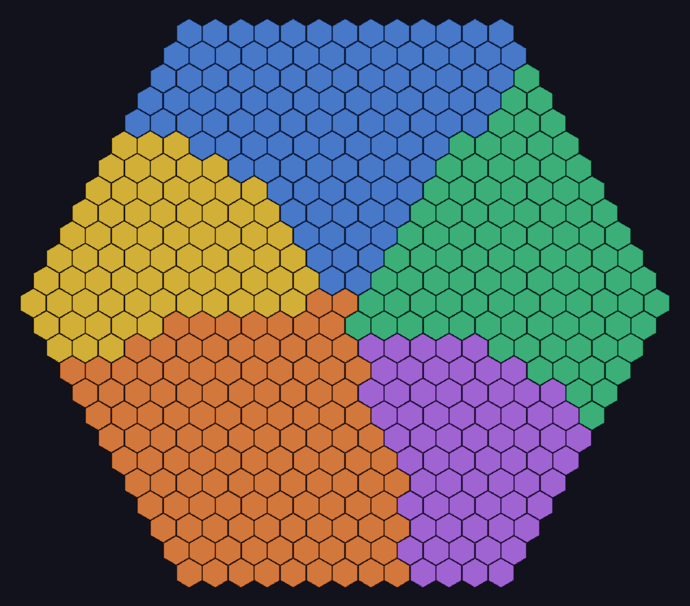
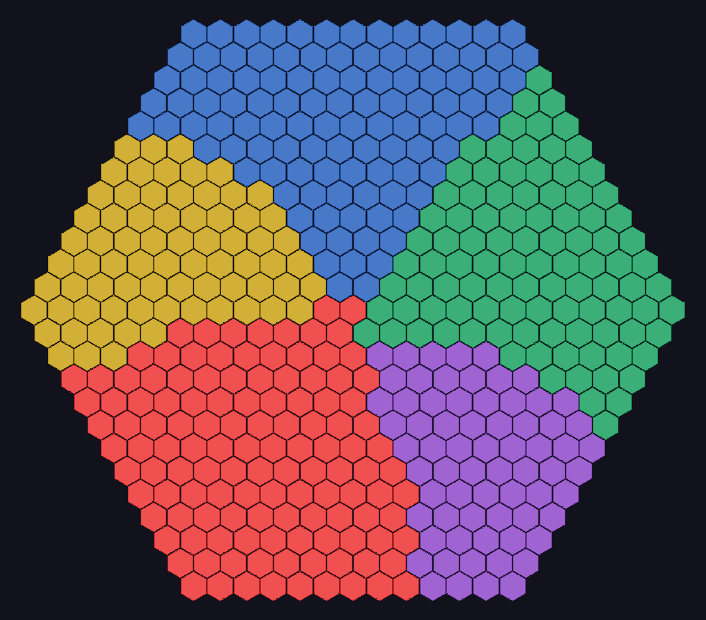

# Flood Fill on a Hex Grid

This small Go project compares two ways to do flood fill on a hexagonal grid.

The goal here is not just to get the right visual result. It is to show why one approach becomes unnecessarily expensive, and why a more direct representation of the grid makes the same job much cheaper.

I put clear comments throughout the code on purpose. This repo is meant for educational use, so the code tries to explain the reasoning, not just the implementation.

## What this project demonstrates

The project builds a hex grid, paints it into Voronoi-style colored regions, and then flood-fills one region using two different algorithms:

- `BadFill`: recursive DFS over an `N x N` adjacency matrix
- `GoodFill`: iterative BFS using hex coordinate neighbor math

Both fills produce the same final region, but they do not get there with the same cost.

## The idea in one sentence

If each hex cell only ever has 6 neighbors, storing all possible cell-to-cell relationships in a full adjacency matrix is doing far more work than the problem actually needs.

## Visual explanation

### 1. Before flood fill

This is the starting grid after the Voronoi regions are painted:



Each color is a separate region. The fill starts from the center area and replaces one connected region with the highlight color.

### 2. Result after the slower approach

`BadFill` uses recursion and an adjacency matrix:


### 3. Result after the better approach

`GoodFill` uses an explicit queue and computes the 6 neighbors directly from cube coordinates:



The final image is intentionally the same. That is the point: this is a performance and data-structure comparison, not a visual-effect comparison.

## Why the first approach is bad

The slower version builds a full adjacency matrix for the grid.

That means:

- memory usage is `O(N^2)`
- building the matrix is `O(N^2)`
- finding neighbors for one cell means scanning an entire row, even though only up to 6 entries can ever matter
- recursion adds call stack growth on top of that

So even though a hex only has 6 real neighbors, the algorithm keeps paying for all `N` possible positions in the matrix row.

In other words, the representation is fighting the shape of the problem.

## Why the second approach is better

The faster version leans into the geometry of hex grids.

Each hex is stored in cube coordinates `(q, r, s)`, and its neighbors are found by adding one of 6 fixed direction vectors. That means:

- neighbor lookup is constant-time
- there is no giant adjacency matrix to allocate
- an iterative queue avoids recursive stack growth
- each reachable cell is processed in a much more direct way

That makes the overall flood fill effectively linear in the number of visited cells.

## Approach summary

### `BadFill`

- Data structure: adjacency matrix
- Traversal: recursive DFS
- Main cost: row scanning for neighbors
- Complexity: roughly `O(N^2)` time, plus recursive stack overhead

### `GoodFill`

- Data structure: map-backed grid with cube coordinates
- Traversal: iterative BFS
- Main advantage: direct neighbor generation
- Complexity: roughly `O(N)` for the fill itself

## Files worth reading

- `grid.go` defines the hex coordinates, neighbor directions, grid generation, and Voronoi painting
- `matrix.go` shows the expensive adjacency-matrix representation
- `bad_fill.go` contains the intentionally inefficient recursive fill
- `good_fill.go` contains the queue-based fill that matches the grid structure
- `render.go` renders the grid to PNG so the result is easy to inspect visually
- `main.go` ties everything together and prints timing comparisons

## Running it

Make sure you have Go installed, then run:

```bash
go run .
```

This will:

- build the sample hex grid
- render the before/after PNGs
- run both flood-fill versions
- print timing results to the console

If you want to run the benchmarks:

```bash
go test -bench=.
```

## Who this is for

This repo is mainly for:

- students learning graph traversal or flood fill
- anyone comparing data-structure choices
- people who want a concrete example of why asymptotic complexity matters
- developers curious about hex-grid coordinate systems

## Final note

This is an educational example, so the "bad" version is kept on purpose. It exists to make the tradeoff obvious.

The most important takeaway is simple: when the problem already gives you a natural neighborhood structure, it is usually better to use that directly than to force everything into a dense graph representation.